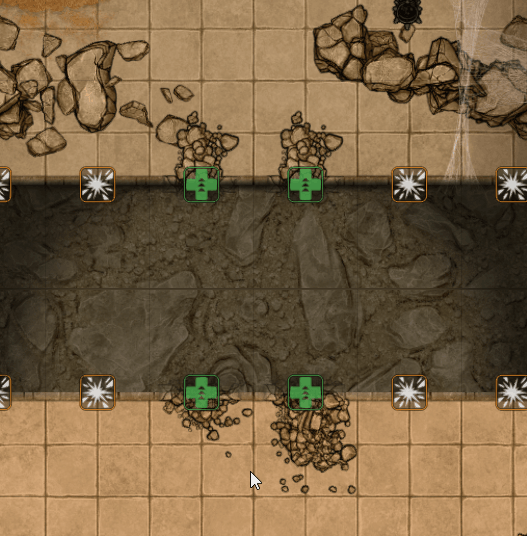
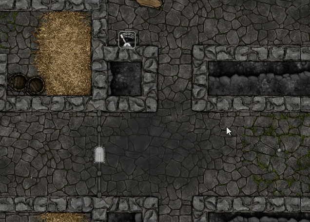
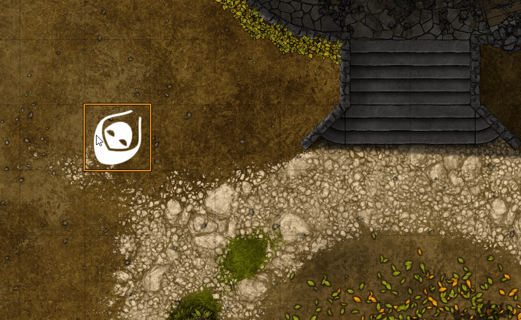

<a id="readme-top"></a>

<div align="center">
  

  <h1>Theik's Toolbag</h1>

  <p>
    <strong>Tools for maps players can change.</strong><br>
    Break scenery, dig packed earth, operate lights and tiles, and move tokens between levels in Foundry Virtual Tabletop.
  </p>

  <p>
    <a href="https://github.com/Theik/theiks-toolbag/releases/latest"></a>
    <a href="https://foundryvtt.com/"></a>
    <a href="https://github.com/Theik/theiks-toolbag/releases"></a>
    <a href="https://github.com/Theik/theiks-toolbag/issues"></a>
    <a href="https://www.patreon.com/cw/TabletopByTheik"></a>
  </p>

  <p>
    <a href="#whats-in-the-bag">Features</a>
    ·
    <a href="#quick-start">Quick start</a>
    ·
    <a href="#feature-guide">Feature guide</a>
    ·
    <a href="#macro-api">Macro API</a>
    ·
    <a href="#installation">Installation</a>
  </p>
</div>

> [!IMPORTANT]
> Theik's Toolbag is built and tested for **Foundry Virtual Tabletop v14**. Each tool has its own world setting.

## What's in the bag

<table>
  <tr>
    <td width="50%">
      <h3>Diggable terrain</h3>
      Fill empty space with packed earth. GMs excavate it from Destruction Mode. Regions can force, suppress, or retexture that earth.
    </td>
    <td width="50%">
      <h3>Breakable walls</h3>
      Destroy and repair walls without deleting them. The module draws rubble on the canvas and keeps the wall's original settings for repair.
    </td>
  </tr>
  <tr>
    <td width="50%">
      <h3>Breakable terrain</h3>
      Give Tiles several damage states. Their opaque pixels can block movement, light, and vision. A Tile can also collapse as a platform.
    </td>
    <td width="50%">
      <h3>Visible lights</h3>
      Give Ambient Lights on, off, and destroyed artwork. GMs and nearby players can operate them from the canvas.
    </td>
  </tr>
  <tr>
    <td width="50%">
      <h3>Level tools</h3>
      Move selected Tokens between Scene Levels. Collapsing platforms can move creatures to the nearest Level below.
    </td>
    <td width="50%">
      <h3>Usable Tiles</h3>
      Add off, intermediate, and on images to doors, levers, machinery, or any other Tile. Nearby players can operate them.
    </td>
  </tr>
  <tr>
    <td width="50%">
      <h3>Script behaviors</h3>
      Run scripts after a Toolbag action succeeds. Each Wall, Tile, or Ambient Light stores its own behaviors.
    </td>
    <td width="50%">
      <h3>Footprints</h3>
      Leave fading tracks as Tokens move. Scenes and Regions decide where prints appear; Tokens can choose their own image or leave none.
    </td>
  </tr>
</table>

## Quick start

1. In Foundry, open **Add-on Modules → Install Module**.
2. Paste the [latest manifest URL](https://github.com/Theik/theiks-toolbag/releases/latest/download/module.json) into **Manifest URL** and select **Install**.
3. Enable **Theik's Toolbag** from **Manage Modules** in your world.
4. Open **Game Settings → Theik's Toolbag** and choose the features you want active.

> [!TIP]
> **Breakable Walls**, **Breakable Terrain**, **Diggable Terrain**, **Visible Lights**, **Usable Tiles**, **Footprints**, and **Level Tools** are enabled by default. Turning one off hides its controls and canvas elements. Saved document flags remain in place.

## Feature guide

### Breakable walls

<p align="center">
  
</p>

Edit a Wall and open the **Theik's Toolbag** tab to mark it as destructible and select its rubble images. The same fields are available in Foundry v14's Wall Palette for bulk editing and for setting defaults on newly drawn walls.

To break a long Wall in smaller pieces, select one or more Walls and right-click the selection. Choose the **hammer** to split every selected Wall into one-grid sections. The last section keeps any shorter remainder. Each new section retains the original Wall settings, Levels, door data, and flags.

<p align="center">
  
</p>

Select **Wall Destruction Mode** from the Walls controls, then interact with the marker over a configured wall:

| Marker | Action | Result |
|:--|:--|:--|
| Explosion | <kbd>Left click</kbd> | Makes the wall nonblocking and draws rubble on the canvas |
| Explosion | <kbd>Right click</kbd> | Destroys the wall without a prompt and picks a valid rubble direction at random |
| Repair | <kbd>Left click</kbd> | Restores the wall's original movement, sight, light, sound, door type, and door state |

- The Wall document is retained; destruction does not create a Tile.
- Rubble is centered on the wall and sized to one wall-length by two wall-lengths.
- Rubble follows opaque background and Tile artwork. Movement-blocking Walls and closed or locked doors stop it from reaching the far side. Open doors and nonblocking Walls do not clip it.
- Rubble Tiles created by older module versions are left unchanged.

### Breakable terrain

<p align="center">
  
</p>

Edit a Tile and open the **Theik's Toolbag** tab. You can make it destroyable, use its opaque artwork to block movement, or block light and vision. Add damage images in order. The last image is the fully destroyed state. Leave a state image empty to hide the Tile at that stage.

Foundry v14's Tile Palette has the same settings for defaults and bulk editing. Matching image dimensions prevent the Tile from changing size between states.

Choose **Terrain Destruction Mode** from the Tiles controls, or use the top-level **Destruction Mode** to show terrain and wall markers together. Scenes with 200 or more destroyable walls and tiles only show those markers within 20 grid spaces of the cursor, so large maps do not stall when the mode is turned on.

| Marker | Action | Result |
|:--|:--|:--|
| Explosion | <kbd>Left click</kbd> | Advances the Tile by one damage state |
| Explosion | <kbd>Right click</kbd> | Moves the Tile back by one damage state |
| Restore | <kbd>Left click</kbd> | Restores the original image |

The Tile's blocking shape follows the opaque pixels in each image. Movement uses those contours. Vision uses one wall envelope around the image, which keeps the Tile visible while it blocks light and sight behind it. The final state removes all movement, light, and vision blocking.

Blocking uses transient Foundry canvas edges. No helper Wall or Tile documents are created, and Tile rotation, anchors, scaling, texture fit, and Scene Levels are respected.

#### Breakable platforms

When **Level Tools** is enabled, destroyable terrain can also become a **Breakable platform** assigned to one or more Scene Levels. When it reaches its final damage state:

<p align="center">
  
</p>

The GM chooses which creatures fall. Each chosen creature moves from its assigned Level to the nearest Level below. The confirmation also identifies creatures already underneath, and one Chat message records the result.

An optional **Destroyed message** adds text to that Chat card. Moving backward through damage states never moves Tokens back up. If Level Tools is off, the Tile behaves as regular breakable terrain. Turning Level Tools back on does not apply an earlier fall.

### Diggable terrain

<p align="center">
  
</p>

On a single-Level Scene, open Scene Config, then the **Toolbag** tab, and enable **Diggable underground**. Pick an undug texture, a dug texture, and a grid size for each. Opaque floors stay. Empty space becomes packed earth. The first save scans the artwork and can stall a large map. Later saves keep what you already dug. Turn it off and on again to rescan.

Multi-level Scenes set this on each Level instead, from the **Levels** tab. Earth only draws on the Level you are viewing. Map Generator themes can write the same data when a map is generated.

**Destruction Mode** adds **Excavate** on a Level that has diggable earth.

| Control | Action | Result |
|:--|:--|:--|
| Excavate | Drag | Digs with a 1×1 disk. Release to save. |
| Repair | Drag | Puts the earth back. |
| Escape | <kbd>Escape</kbd> | Cancels the stroke. |

**Reset destructables** fills every dug cell in the Scene.

Add a Region behavior to change earth inside a shape, with no extra scan:

- **Force Diggable Terrain.** Fills the Region with earth even over opaque floors, drawn on top of those floors.
- **Suppress Diggable Terrain.** Removes earth, including in shafts and other holes. Wins if it overlaps Force.
- **Alter Diggable Terrain.** Overrides textures or grid sizes. Leave a field blank to keep the Level setting.

Only a GM can dig.

### Usable Tiles

<p align="center">
  
</p>

Edit a Tile and open the **Theik's Toolbag** tab to mark it as **Usable**. Add at least two images. The first is **off**, the last is **on**, and any images between them are **step** states. Empty images are not allowed. Saving or reordering the list resets the Tile to off.

Each click moves one state toward the other endpoint. After the Tile reaches on, clicks move backward through the same states until it reaches off. The direction then reverses again. A two-image Tile switches directly between off and on.

While the normal Token controls are active, a lever marker appears over each available Tile:

The lever is mirrored while the Tile is moving toward on. It returns to its normal orientation while the Tile is moving toward off.

| User | Action | Result |
|:--|:--|:--|
| GM | <kbd>Left click</kbd> | Uses the Tile from anywhere |
| Player | <kbd>Left click</kbd> | Uses the Tile when a selected, owned Token is on or adjacent to its opaque artwork, on the same Level and elevation, with no movement-blocking wall in the way |

Transparent padding, holes, and gaps between separate parts of an image do not extend its reach. On a gridded Scene, diagonal adjacency counts. On a gridless Scene, the Token must be within one grid unit of the nearest opaque part of the image.

A Tile can be usable and breakable. Any Breakable Terrain damage or Foundry Hidden state hides the lever marker and blocks use. The damage image takes priority. Repair restores the usable image that was visible before the damage. Terrain Destruction Mode and the combined Destruction Mode also hide lever markers, so the controls do not overlap.

Usable Tiles manages the Tile's native image. Disable usability before replacing that image directly. Usable Tiles and Breakable Terrain share the Toolbag tab, but their world settings remain independent.

### Footprints

<p align="center">
  
</p>

The world **Footprints** setting is on by default, but each Scene starts with footprints off. The bundled left-foot image is selected as the world default. In Scene Config, open the **Toolbag** tab to enable footprints and set a Scene image or tint. Each Level inherits those fields until a GM overrides them.

Each step alternates the chosen left-foot image with a mirrored right foot. Print size and spacing follow the Token's size. Tokens and prototype Tokens can choose an image or enable **Leaves no footprints**. A Token image takes priority over Region, Level, Scene, and world images.

Add **Theik's Toolbox: Footprint behaviour** to a Region for local rules:

- **Suppress footprints** stops prints in the Region, even where another Region enables them.
- **Enable footprints** starts a trail and can choose an image for that Region.
- **Situational footprints** keeps a trail going only when the Token came from a space with footprints enabled.
- **Tint footprints** sets a color independently of the enablement rule and overrides the Level or Scene tint.

The Region image works with **No change** and **Situational footprints** too. It changes prints made there without enabling footprints.

Each user can set **Visible footprint trail length** from 0 to 100 grid spaces, starting at 15. It changes only that user's view; 0 hides prints. Prints start fading halfway through the visible trail and become nearly transparent at the cutoff or the 100-print cap. GMs see prints on the viewed Level. Players see prints within their current vision, or everywhere on Scenes without token vision.

The active GM saves trails on the Scene, so they survive reloads and Token deletion. Without a connected GM, prints still appear during play but may be lost on reload. Disabling footprints on a Scene, Level, or Region erases prints in that area. **Clear footprints on this map** in Scene Config erases every Level's trail. Turning off the world feature hides trails and stops new prints without erasing the saved ones.

### Level tools

<p align="center">
  
</p>

Right-click a Token and choose **Change Level + Elevation**, shown with a ladder directly beneath Foundry's native Level control, to move all currently selected Tokens to another Scene Level.

The dialog changes each Token's native Level and sets its elevation to the bottom of that Level. If the target is lower than a selected Token's current Level, the dialog shows a **Falling** checkbox. It is off by default. Turn it on to post one Chat message with the Tokens that moved down and their fall distances. Only GMs can use the control, and the Scene must have at least two Levels.

The **Falling Chat messages** setting controls both manual Token-fall summaries and breakable-platform collapse cards. Disabling the messages does not prevent movement or platform destruction.

### Visible lights

<p align="center">
  
</p>

Edit an Ambient Light and open the **Theik's Toolbag** tab to choose square images for its on, off, and destroyed states. The module centers the current image on the light and sizes it to one grid space. It follows the light when it moves or rotates. No Tile document is created.

While the normal Token controls are active, a control appears over each configured fixture next to
a controlled Token. GMs can choose **Light Toggle Mode**, below **Destruction Mode**, to show every
configured fixture in the Scene:

| User | Action | Result |
|:--|:--|:--|
| GM | <kbd>Left click</kbd> | Toggles the light on or off |
| GM | <kbd>Right click</kbd> | Destroys the fixture and switches it off |
| GM (destroyed) | <kbd>Left click</kbd> | Repairs the fixture; it remains switched off |
| Player | <kbd>Left click</kbd> | Toggles the fixture when its grid space is the same as or adjacent to one occupied by a selected, owned Token, with no movement-blocking wall between them |

Destroyed lights cannot be toggled by players. A GM can repair one by clicking its green repair marker or by clearing **Destroyed** in the Light configuration.

### Script behaviors

<p align="center">
  
</p>

The **Theik's Toolbag** tab has Region-style script behaviors that run after successful Toolbag actions. A document can have several named behaviors. Each behavior has its own enabled state and one or more triggers.

| Document | Events |
|:--|:--|
| Ambient Light | **Toggled on**, **Toggled off**, **Destroyed**, **Repaired** |
| Wall | **Destroyed**, **Repaired** |
| Breakable Terrain | **Damaged**, **Destroyed**, **Repaired (Partial)**, **Repaired** |
| Usable Tile | **Off**, **On**, **Step** |

**Damaged** and **Repaired (Partial)** are available when terrain has more than one damage state. Removing states does not delete existing subscriptions. The authoritative GM runs behaviors after updating the document. A behavior cannot delay or undo the action. One failed behavior does not stop the others, and matching behaviors may run in any order.

Each script receives `scene`, `document`, a type-specific alias (`light`, `wall`, or `tile`), `behavior`, and `event`. The event provides `event.name`, `event.user`, `event.data.document`, `event.data.previous`, and `event.data.current`. For example, a Wall behavior subscribed to **Destroyed** can be as short as:

```js
ui.notifications.info(`${wall.name ?? wall.id} was destroyed.`);
```

Creation palettes can add behaviors to newly drawn placeables. During bulk editing, behavior controls appear only when every selected document has the same behavior list. Use the palette's **Apply** button to save the changes.

The module displays old fixed event scripts as one-trigger behaviors. The first behavior edit saves the new collection and removes the old fixed fields, so no world migration is needed. Toolbag controls and Macro API calls trigger behaviors. Direct flag edits do not.

## Macro API

The public API gives macros the same operations as the canvas controls. Optional chaining makes these examples do nothing when the module or method is unavailable.

<details>
<summary><strong>Breakable walls:</strong> prompt, destroy, repair, and toggle</summary>

#### Interactive prompt

```js
await game.modules.get("theiks-toolbag")?.api?.breakableWalls?.prompt?.(
  canvas.walls?.controlled?.[0]?.document
);
```

#### Direct operation

```js
await game.modules.get("theiks-toolbag")?.api?.breakableWalls?.destroy?.(
  canvas.walls?.controlled?.[0]?.document,
  {kind: "single", side: "positive"}
);
```

Replace `destroy` with `repair` or `toggle` for those operations. `destroy` resolves to the updated `WallDocument`, rather than a rubble Tile. `toggle` opens the destruction prompt for an intact wall and immediately repairs a destroyed wall.

</details>

<details>
<summary><strong>Breakable terrain:</strong> advance, retreat, and restore</summary>

Replace `advance` with `retreat` or `restore` for those operations:

```js
await game.modules.get("theiks-toolbag")?.api?.breakableTerrain?.advance?.(
  canvas.tiles?.controlled?.[0]?.document
);
```

`advance` resolves to `null` when a final-stage platform confirmation is canceled.

</details>

<details>
<summary><strong>Diggable terrain:</strong> availability, source creation, dig, repair, and reset</summary>

```js
const underground = game.modules.get("theiks-toolbag")?.api?.undergroundTerrain;
if (underground?.isAvailable?.()) {
  await underground.dig(canvas.scene, [12, 13, 14]);
  await underground.repair(canvas.scene, [13]);
  await underground.reset(canvas.scene);
}

// GM console: paint occupancy subcells in transparent blue
underground?.toggleOverlay?.();
underground?.toggleOverlay?.(true);
```

`schemaVersion` is currently `2`. `createSource(options)` validates and encodes a row-major logical source-cell array plus a finer dug mask for integrations. Supply the grid origin and dimensions, Level ID, intact and dug texture paths, and movement and vision blocking choices. `createSourceFromScene(scene, options)` builds that same source from the Scene's playable grid and punches holes for opaque Tile pixels. The mutating calls are GM-only, ignore indexes outside the original source mask, merge against the latest dug mask, and perform at most one document update per call. Dig and repair target the viewed Level. Reset clears every Level in the Scene. `toggleOverlay()` is a local GM debug view of the occupancy mask; it does not change Scene data.

</details>

<details>
<summary><strong>Usable Tiles:</strong> advance one use state</summary>

```js
await game.modules.get("theiks-toolbag")?.api?.usableTiles?.use?.(
  canvas.tiles?.controlled?.[0]?.document
);
```

`use` applies the same state sequence and access checks as the hand control. It resolves to the updated `TileDocument`.

</details>

<details>
<summary><strong>Level tools:</strong> prompt or move directly</summary>

```js
const tokens = canvas.tokens.controlled.map(token => token.document);

// Interactive:
await game.modules.get("theiks-toolbag")?.api?.levelTools?.prompt?.(tokens);

// Direct:
await game.modules.get("theiks-toolbag")?.api?.levelTools?.change?.(
  tokens,
  {levelId: canvas.level.id, falling: false}
);
```

Set `falling` to `true` to treat downward movement as a fall and create the configured falling-creatures message. It defaults to `false` when omitted.

An Execute Script Region Behavior can safely change the entering Token's elevation after its current movement finishes:

```js
await game.modules.get("theiks-toolbag")?.api?.updateElevation?.(event.data.token, 2, false, true);
```

The third argument defaults to `false`. Pass `true` to count a downward elevation change as falling. The fourth argument, `levelTransition`, also defaults to `false`. When it is `true`, the Token moves to the native Scene Level that contains its new elevation. The local view follows it. If no Level contains that elevation, only the elevation changes.

The fifth argument, `ignoreCeiling`, defaults to `false`. Pass `true` to ignore Foundry's wall and surface constraints while keeping the Token on its current Level. This supports stairs that rise above one Level's ceiling before reaching the next Level.

```js
await game.modules.get("theiks-toolbag")?.api?.updateElevation?.(event.data.token, 9, false, false, true);
```

If one Token movement crosses several adjacent elevation Regions, the module keeps only the final pending elevation call. It applies that call after Foundry's movement animation ends. Competing calls cannot stop the Token between steps or alter the active animation chain.

</details>

<details>
<summary><strong>Visible lights:</strong> toggle, destroy, or repair</summary>

Replace `toggle` with `destroy` or `repair` for those operations:

```js
await game.modules.get("theiks-toolbag")?.api?.visibleLights?.toggle?.(
  canvas.lighting?.controlled?.[0]?.document
);
```

</details>

## Settings

Open **Game Settings → Theik's Toolbag** to enable or disable these feature groups independently:

- **Breakable Walls**
- **Breakable Terrain**
- **Diggable Terrain**
- **Visible Lights**
- **Usable Tiles**
- **Footprints**
- **Level Tools**

Disabling a feature hides its configuration and controls, removes its runtime canvas elements, and prevents its macro actions. Saved document flags are never deleted. The **Falling Chat messages** subsection under Level Tools separately controls manual fall summaries and platform-collapse cards.

## Installation

### Release installation

Install the latest published release using this manifest URL:

```text
https://github.com/Theik/theiks-toolbag/releases/latest/download/module.json
```

### Development installation

Clone this repository into Foundry's `Data/modules/theiks-toolbag` directory, restart Foundry, and enable **Theik's Toolbag** from **Manage Modules** in your world.

## License, credits, and legal

<div>
  <p>
    <strong>Code:</strong> Original module code and documentation are released under the <a href="LICENSE">MIT License</a>.
  </p>
  <p>
    <strong>Cartography:</strong> Demo maps were created with <a href="https://dungeondraft.net/">Dungeondraft</a> by Megasploot.<br>
    <strong>Artwork:</strong> Maps were created using assets from <a href="https://www.forgotten-adventures.net/">Forgotten Adventures</a>.
  </p>
  <p>
    <strong>Development:</strong> <a href="https://openai.com/chatgpt/overview/">ChatGPT</a> by OpenAI was used as a programming assistant.
  </p>
</div>

The MIT License does **not** cover bundled assets, demo-map artwork, compendium content containing third-party material, or third-party names and trademarks. Those materials remain subject to their respective owners' terms. See [Third-Party Notices](THIRD_PARTY_NOTICES.md) for the complete attribution and license-scope details.

Theik's Toolbag is an independent package for use with a licensed copy of Foundry Virtual Tabletop. It is not affiliated with or endorsed by Foundry Gaming LLC, Megasploot, Forgotten Adventures, or OpenAI. Foundry Virtual Tabletop and all other third-party names and trademarks belong to their respective owners.

---

<div align="center">
  

  <p><strong>Built by <a href="https://github.com/Theik">Theik</a>.</strong></p>
  <p>
    <a href="https://github.com/Theik/theiks-toolbag/releases">Releases</a>
    ·
    <a href="https://github.com/Theik/theiks-toolbag/issues">Report an issue</a>
    ·
    <a href="https://www.patreon.com/cw/TabletopByTheik">Support on Patreon</a>
    ·
    <a href="#readme-top">Back to top ↑</a>
  </p>
</div>
