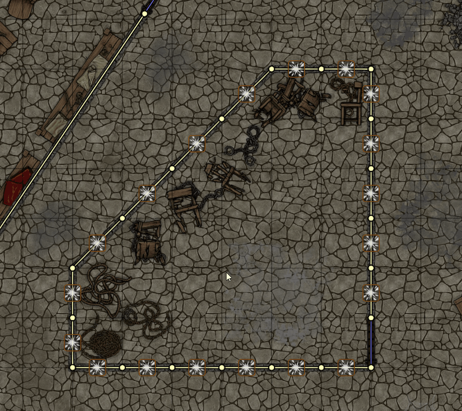
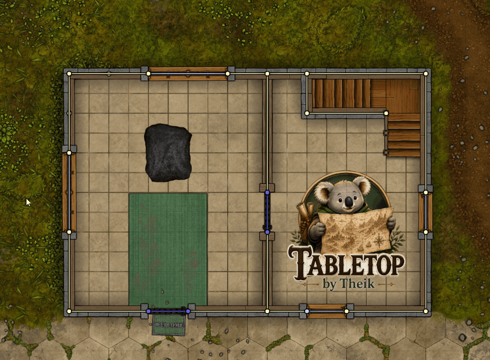
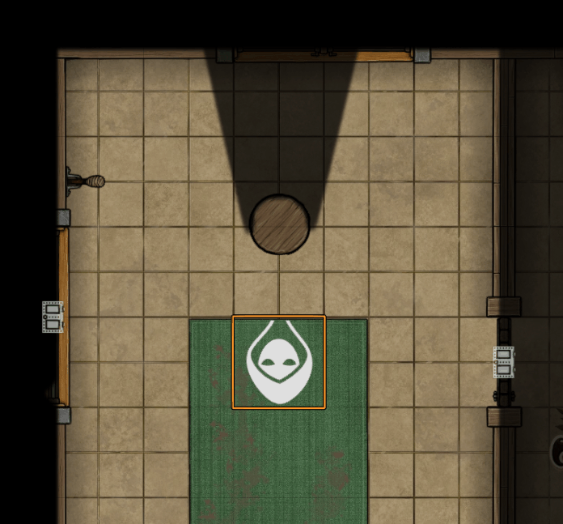
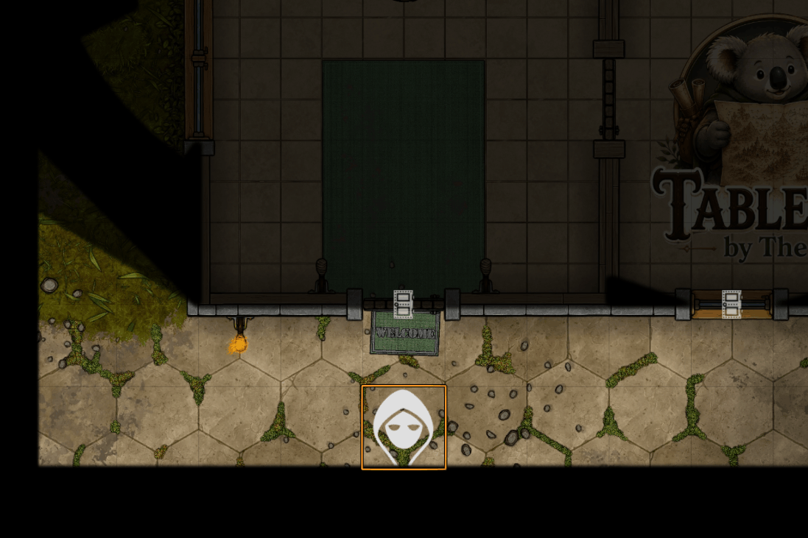
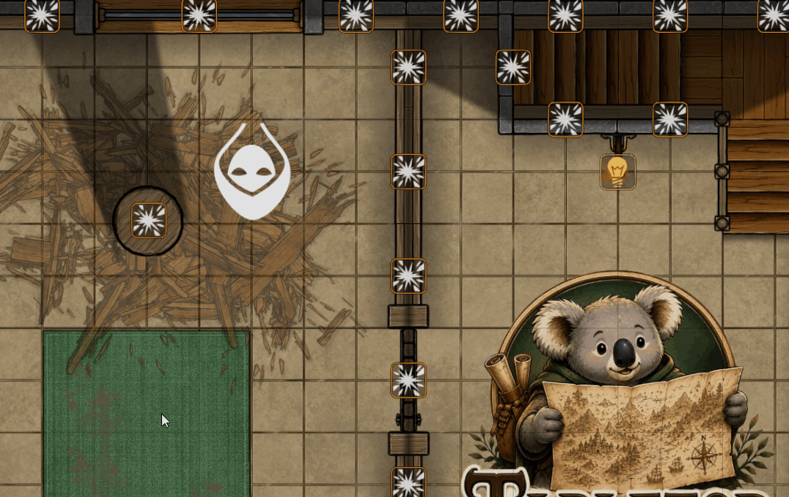

<a id="readme-top"></a>

<div align="center">
  

  <h1>Theik's Toolbag</h1>

  <p>
    <strong>Make the dungeon react to your players.</strong><br>
    Destructible scenery, interactive lights, and level-aware tools for Foundry Virtual Tabletop.
  </p>

  <p>
    <a href="https://github.com/Theik/theiks-toolbag/releases/latest"></a>
    <a href="https://foundryvtt.com/"></a>
    <a href="https://github.com/Theik/theiks-toolbag/releases"></a>
    <a href="https://github.com/Theik/theiks-toolbag/issues"></a>
    <a href="https://www.patreon.com/cw/TabletopByTheik"></a>
  </p>

  <p>
    <a href="#-whats-in-the-bag">Features</a>
    ·
    <a href="#-quick-start">Quick start</a>
    ·
    <a href="#-feature-guide">Feature guide</a>
    ·
    <a href="#-macro-api">Macro API</a>
    ·
    <a href="#-installation">Installation</a>
  </p>
</div>

> [!IMPORTANT]
> Theik's Toolbag is built for and verified on **Foundry Virtual Tabletop v14**. Every feature is independently configurable, so you can use only the tools that fit your world.

## 🧰 What's in the bag

<table>
  <tr>
    <td width="50%">
      <h3>💥 Breakable Walls</h3>
      Destroy and repair walls without deleting their documents. Rubble is drawn directly on the canvas and the wall's original configuration is preserved.
    </td>
    <td width="50%">
      <h3>🪨 Breakable Terrain</h3>
      Give tiles multiple damage states, pixel-perfect movement blocking, light and vision blocking, and optional breakable-platform behavior.
    </td>
  </tr>
  <tr>
    <td width="50%">
      <h3>🕯️ Visible Lights</h3>
      Turn ambient lights into visible, interactive fixtures that GMs—and nearby players—can toggle directly on the canvas.
    </td>
    <td width="50%">
      <h3>🪜 Level Tools</h3>
      Move selected tokens between Scene Levels and let collapsing platforms send creatures tumbling to the nearest level below.
    </td>
  </tr>
</table>

## 🚀 Quick start

1. In Foundry, open **Add-on Modules → Install Module**.
2. Paste the [latest manifest URL](https://github.com/Theik/theiks-toolbag/releases/latest/download/module.json) into **Manifest URL** and select **Install**.
3. Enable **Theik's Toolbag** from **Manage Modules** in your world.
4. Open **Game Settings → Theik's Toolbag** and choose the features you want active.

> [!TIP]
> **Breakable Walls**, **Breakable Terrain**, **Visible Lights**, and **Level Tools** are all enabled by default. Disabling one hides its controls and removes its runtime canvas elements without deleting saved document flags.

## ✨ Feature guide

### 💥 Breakable Walls

> Turn a solid boundary into battlefield debris—and put it back exactly as it was.

<p align="center">
  
</p>

Edit a Wall and open the **Theik's Toolbag** tab to mark it as destructible and select its rubble images. The same fields are available in Foundry v14's Wall Palette for bulk editing and for setting defaults on newly drawn walls.

To prepare longer walls for localized destruction, select one or more Walls and right-click any selected Wall. Choose the **hammer** to split the full selection into one-grid-length sections; if a Wall is not an exact grid multiple, its final section uses the shorter remainder. All Wall settings, Levels, doors, and flags are preserved on the resulting sections.

<p align="center">
  
</p>

Select **Wall Destruction Mode** from the Walls controls, then interact with the marker over a configured wall:

| Marker | Action | Result |
|:--|:--|:--|
| 🟠 Explosion | <kbd>Left click</kbd> | Makes the wall nonblocking and renders rubble directly on the canvas |
| 🟠 Explosion | <kbd>Right click</kbd> | Immediately destroys the wall with a random valid rubble direction |
| 🟢 Repair | <kbd>Left click</kbd> | Restores the wall's original movement, sight, light, sound, door type, and door state |

- The Wall document is retained; destruction does not create a Tile.
- Rubble is centered on the wall and sized to one wall-length by two wall-lengths.
- Rubble Tiles created by older module versions are left unchanged.

<p align="right"><a href="#readme-top">Back to top ↑</a></p>

---

### 🪨 Breakable Terrain

> Build scenery that cracks, crumbles, blocks the battlefield, and eventually gives way.

<p align="center">
  
</p>

Edit a Tile and open the **Theik's Toolbag** tab to make it destroyable, make its opaque artwork block movement, and/or make it block light and vision. Add destroyed-state images in order; the final image represents fully destroyed terrain. A state may use an empty image to hide the Tile at that stage.

The same settings are available in Foundry v14's Tile Palette for defaults and bulk editing. For the smoothest transition, use images with matching dimensions for every state.

Choose **Terrain Destruction Mode** from the Tiles controls, or use the top-level **Destruction Mode** to show terrain and wall markers together:

| Marker | Action | Result |
|:--|:--|:--|
| 🟠 Explosion | <kbd>Left click</kbd> | Advances the Tile by one damage state |
| 🟠 Explosion | <kbd>Right click</kbd> | Moves the Tile back by one damage state |
| 🟢 Restore | <kbd>Left click</kbd> | Immediately restores the original image |

The Tile's blocking silhouette follows the opaque pixels of every image. Movement uses the exact opaque contours; vision uses one terrain-wall envelope around the full image so the Tile stays visible while light and sight are blocked behind it. At the final state, all movement, light, and vision blocking is removed.

Blocking uses transient Foundry canvas edges. No helper Wall or Tile documents are created, and Tile rotation, anchors, scaling, texture fit, and Scene Levels are respected.

#### Breakable platforms

When **Level Tools** is enabled, destroyable terrain can also become a **Breakable platform** assigned to one or more Scene Levels. When it reaches its final damage state:

<p align="center">
  
</p>

1. The GM chooses which creatures on the platform should fall.
2. Each chosen creature moves from its assigned Level to the nearest Level below.
3. Creatures already underneath are identified in the confirmation.
4. One Chat message summarizes the result.

An optional **Destroyed message** adds an introductory sentence to that Chat card. Moving backward through damage states never moves Tokens back up. If Level Tools is disabled, the Tile behaves as normal breakable terrain and no fall is applied retroactively when the feature is re-enabled.

<p align="right"><a href="#readme-top">Back to top ↑</a></p>

---

### 🪜 Level Tools

> Move a whole group between floors—or let gravity do the work.

<p align="center">
  
</p>

Right-click a Token and choose **Change Level + Elevation**, shown with a ladder directly beneath Foundry's native Level control, to move all currently selected Tokens to another Scene Level.

The dialog updates each Token's native Level and sets its elevation to that Level's bottom elevation. When the target is below a selected Token's current Level, a **Falling** checkbox appears; it is off by default, and enabling it posts one combined Chat message listing each Token that moved downward and its fall distance. The control is available only to GMs and only in Scenes with at least two Levels.

The **Falling Chat messages** setting controls both manual Token-fall summaries and breakable-platform collapse cards. Disabling the messages does not prevent movement or platform destruction.

<p align="right"><a href="#readme-top">Back to top ↑</a></p>

---

### 🕯️ Visible Lights

> Put the torch, lantern, or magical fixture on the map—not just its glow.

<p align="center">
  
</p>

Edit an Ambient Light and open the **Theik's Toolbag** tab to choose square artwork for its on, off, and destroyed states. The current artwork is centered on the light, rendered at one grid space in each direction, and follows the light when it moves or rotates without creating extra Tile documents.

While the normal Token controls are active, a control appears over every configured fixture:

| User | Action | Result |
|:--|:--|:--|
| GM | <kbd>Left click</kbd> | Toggles the light on or off from anywhere |
| GM | <kbd>Right click</kbd> | Destroys the fixture and switches it off |
| GM (destroyed) | <kbd>Left click</kbd> | Repairs the fixture; it remains switched off |
| Player | <kbd>Left click</kbd> | Toggles the fixture when its grid space is the same as or adjacent to one occupied by a selected, owned Token, with no movement-blocking wall between them |

Destroyed lights cannot be toggled by players. A GM can repair one by clicking its green repair marker or by clearing **Destroyed** in the Light configuration.

<p align="right"><a href="#readme-top">Back to top ↑</a></p>

### ⚡ Script behaviors

<p align="center">
  
</p>

The **Theik's Toolbag** tab includes Region-style script behaviors for reacting to successful Toolbag actions. Add as many named behaviors as needed, enable or disable each one independently, and choose one or more triggers for every behavior:

| Document | Events |
|:--|:--|
| Ambient Light | **Toggled on**, **Toggled off**, **Destroyed**, **Repaired** |
| Wall | **Destroyed**, **Repaired** |
| Breakable Terrain | **Damaged**, **Destroyed**, **Repaired (Partial)**, **Repaired** |

**Damaged** and **Repaired (Partial)** can be selected when terrain has more than one damage state. Existing subscriptions are preserved if states are later removed. Behaviors run asynchronously on the authoritative GM after the document has been updated. They do not delay or undo the action, failures are isolated per behavior, and matching behaviors have no guaranteed execution order.

Each script receives `scene`, `document`, a type-specific alias (`light`, `wall`, or `tile`), `behavior`, and `event`. The event provides `event.name`, `event.user`, `event.data.document`, `event.data.previous`, and `event.data.current`. For example, a Wall behavior subscribed to **Destroyed** can be as short as:

```js
ui.notifications.info(`${wall.name ?? wall.id} was destroyed.`);
```

Creation palettes can define behaviors inherited by newly drawn placeables. When bulk-editing selected placeables, behavior controls are available only if every selected document has the same behavior list; changes are applied through the palette's normal **Apply** button.

Existing fixed event scripts are shown automatically as one-trigger behaviors. No world migration is required: the first behavior change saves the new collection and removes the legacy fixed fields. Only actions performed through Theik's Toolbag controls or Macro API trigger behaviors; editing flags directly does not.

<p align="right"><a href="#readme-top">Back to top ↑</a></p>

## 🧩 Macro API

The public API lets macros use the same operations as the canvas controls. These concise examples safely do nothing when the module or requested API is unavailable.

<details>
<summary><strong>Breakable Walls</strong> — prompt, destroy, repair, and toggle</summary>

#### Interactive prompt

```js
await game.modules.get("theiks-toolbag")?.api?.breakableWalls?.prompt?.(
  canvas.walls?.controlled?.[0]?.document
);
```

#### Direct operation

```js
await game.modules.get("theiks-toolbag")?.api?.breakableWalls?.destroy?.(
  canvas.walls?.controlled?.[0]?.document,
  {kind: "single", side: "positive"}
);
```

Replace `destroy` with `repair` or `toggle` for those operations. `destroy` resolves to the updated `WallDocument`, rather than a rubble Tile. `toggle` opens the destruction prompt for an intact wall and immediately repairs a destroyed wall.

</details>

<details>
<summary><strong>Breakable Terrain</strong> — advance, retreat, and restore</summary>

Replace `advance` with `retreat` or `restore` for those operations:

```js
await game.modules.get("theiks-toolbag")?.api?.breakableTerrain?.advance?.(
  canvas.tiles?.controlled?.[0]?.document
);
```

`advance` resolves to `null` when a final-stage platform confirmation is canceled.

</details>

<details>
<summary><strong>Level Tools</strong> — prompt or move directly</summary>

```js
const tokens = canvas.tokens.controlled.map(token => token.document);

// Interactive:
await game.modules.get("theiks-toolbag")?.api?.levelTools?.prompt?.(tokens);

// Direct:
await game.modules.get("theiks-toolbag")?.api?.levelTools?.change?.(
  tokens,
  {levelId: canvas.level.id, falling: false}
);
```

Set `falling` to `true` to treat downward movement as a fall and create the configured falling-creatures message. It defaults to `false` when omitted.

An Execute Script Region Behavior can safely change the entering Token's elevation after its current movement finishes:

```js
await game.modules.get("theiks-toolbag")?.api?.updateElevation?.(event.data.token, 2, false, true);
```

The third argument is optional and defaults to `false`. Pass `true` to count a downward elevation change as falling. The fourth `levelTransition` argument also defaults to `false`; when `true`, the Token moves to the native Scene Level containing its new elevation while keeping that exact elevation, and the local view follows it to that Level. If no Level contains the elevation, only the elevation changes.

The fifth `ignoreCeiling` argument defaults to `false`. Pass `true` to ignore Foundry's wall and surface constraints for the elevation change while keeping the Token on its current Level. This is useful for stairways which rise above one Level's ceiling before reaching the next Level:

```js
await game.modules.get("theiks-toolbag")?.api?.updateElevation?.(event.data.token, 9, false, false, true);
```

When one Token movement crosses multiple adjacent elevation Regions, pending calls are coalesced so only the final Region's elevation is applied after Foundry's chained movement animation ends. This prevents competing follow-up movements from stopping the Token between stair steps or corrupting the active animation chain.

</details>

<details>
<summary><strong>Visible Lights</strong> — toggle, destroy, or repair</summary>

Replace `toggle` with `destroy` or `repair` for those operations:

```js
await game.modules.get("theiks-toolbag")?.api?.visibleLights?.toggle?.(
  canvas.lighting?.controlled?.[0]?.document
);
```

</details>

## ⚙️ Settings

Open **Game Settings → Theik's Toolbag** to enable or disable these feature groups independently:

- **Breakable Walls**
- **Breakable Terrain**
- **Visible Lights**
- **Level Tools**

Disabling a feature hides its configuration and controls, removes its runtime canvas elements, and prevents its macro actions. Saved document flags are never deleted. The **Falling Chat messages** subsection under Level Tools separately controls manual fall summaries and platform-collapse cards.

## 📦 Installation

### Release installation

Install the latest published release using this manifest URL:

```text
https://github.com/Theik/theiks-toolbag/releases/latest/download/module.json
```

### Development installation

Clone this repository into Foundry's `Data/modules/theiks-toolbag` directory, restart Foundry, and enable **Theik's Toolbag** from **Manage Modules** in your world.

## ⚖️ License, credits & legal

<div>
  <p>
    <strong>Code:</strong> Original module code and documentation are released under the <a href="LICENSE">MIT License</a>.
  </p>
  <p>
    <strong>Cartography:</strong> Demo maps were created with <a href="https://dungeondraft.net/">Dungeondraft</a> by Megasploot.<br>
    <strong>Artwork:</strong> Maps were created using assets from <a href="https://www.forgotten-adventures.net/">Forgotten Adventures</a>.
  </p>
  <p>
    <strong>Development:</strong> <a href="https://openai.com/chatgpt/overview/">ChatGPT</a> by OpenAI was used as a programming assistant.
  </p>
</div>

The MIT License does **not** cover bundled assets, demo-map artwork, compendium content containing third-party material, or third-party names and trademarks. Those materials remain subject to their respective owners' terms. See [Third-Party Notices](THIRD_PARTY_NOTICES.md) for the complete attribution and license-scope details.

Theik's Toolbag is an independent package for use with a licensed copy of Foundry Virtual Tabletop. It is not affiliated with or endorsed by Foundry Gaming LLC, Megasploot, Forgotten Adventures, or OpenAI. Foundry Virtual Tabletop and all other third-party names and trademarks belong to their respective owners.

---

<div align="center">
  

  <p><strong>Built by <a href="https://github.com/Theik">Theik</a> for adventurous tables.</strong></p>
  <p>
    <a href="https://github.com/Theik/theiks-toolbag/releases">Releases</a>
    ·
    <a href="https://github.com/Theik/theiks-toolbag/issues">Report an issue</a>
    ·
    <a href="https://www.patreon.com/cw/TabletopByTheik">Support on Patreon</a>
    ·
    <a href="#readme-top">Back to top ↑</a>
  </p>
</div>
